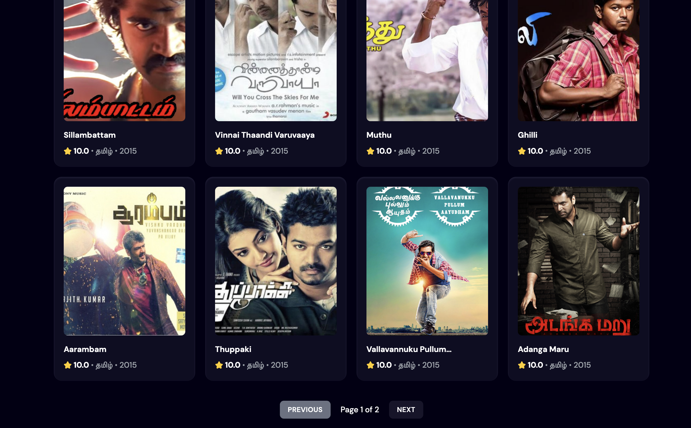

[](https://reactjs.org/)
[](https://spring.io/projects/spring-boot)
[](https://www.elastic.co/elasticsearch/)
[](LICENSE)
[](https://www.docker.com/)

# Movie Search Application

A **containerized full-stack movie search application** built using **React**, **Spring Boot**, and **Elasticsearch**.  
This project allows users to search for movies with real-time fuzzy search capabilities, browse results with pagination and manage movie data through RESTful APIs.

# Application UI

## HomePage


## Search Feature - Fuzzy Search


## Paginated Results



### Postman Request Example


---

## Table of Contents

- [Overview](#overview)
- [Architecture](#architecture)
- [Tech Stack](#tech-stack)
- [Features](#features)
- [Swagger](#swagger-documentation)
- [Application Setup](#application-setup)
- [Frontend (React)](#frontend-react)
- [Backend (Spring Boot)](#backend-spring-boot)
- [API Endpoints](#api-endpoints)
- [FAQ's](#FAQ's)
- [License](#license)

---

## Overview

This application enables users to search for and retrieve movie data using Elasticsearch as the search engine for efficient indexing and fuzzy matching.  
Movie data can be added, updated, and deleted via dedicated backend endpoints, typically accessed using Postman or similar tools.

---

## Architecture

```
+-------------------------------+
|  React Frontend (Port: 8086)  |
+-------------------------------+
             |
             v
+-------------------------------------------+
|  Nginx Server (LoadBalancer) (Port: 8080) |
+-------------------------------------------+
             |
             v
+----------------------------------+
| Spring Boot Backend (Port: 8085) |
+----------------------------------+
             |
             v
+-------------------------------+
| Elasticsearch (Search Engine) |
+-------------------------------+
```

The frontend communicates with the backend via RESTful APIs.  
The backend handles all data interactions with Elasticsearch.

---

## Tech Stack

- **Frontend:** React (JavaScript)
- **Backend:** Spring Boot (Java)
- **Search Engine:** Elasticsearch
- **Containerization:** Docker
- **Build Tools:** Maven, npm

---

## Features

- Movie search using fuzzy matching with Elasticsearch
- Efficient pagination for large datasets, with page number and page size support
- List all movies with a single API request
- Add, update, or delete movies through backend endpoints
- Containerized setup for easy deployment

---

## Swagger Documentation

I have used **Swagger UI** to provide interactive API documentation for the Movie API. With Swagger UI, you can easily explore the available endpoints, understand the request/response structure, and try out the API calls directly from the browser.

### How to Access Swagger UI

Once the application is up and running, you can access the Swagger UI by visiting the following URL:
http://domain-name:port/swagger-ui.html
For ex: http://localhost:8083/swagger-ui.html

This page will display a list of all available API endpoints, including descriptions of each operation, expected responses, request parameters, and response models.

### Swagger Features

- **Interactive Documentation**: You can interact with the API by sending requests directly from the Swagger UI.
- **Response Codes**: Each API operation provides response codes and descriptions (e.g., `200 OK`, `404 Not Found`).
- **Request/Response Examples**: The UI shows example requests and responses, making it easier to understand how to interact with the API.
- **Filtering and Searching**: Easily filter and search through the API operations to find what you need.

### Swagger Annotations

The API is documented using **Springdoc OpenAPI**, which automatically generates the Swagger UI from annotations in the code. Here's how it works:

- **`@Operation`**: Describes the summary and details of each endpoint.
- **`@ApiResponse`**: Specifies the possible HTTP responses for each operation.
- **`@ApiResponses`**: Groups multiple responses for an endpoint, allowing for detailed API documentation.

This allows you to easily interact with the API in a user-friendly interface while providing full visibility into the available API features.

---

## Application Setup

1. Clone this repository

```
   git clone https://github.com/harish124/movie-app-react.git
   cd movie-app-react/
```

2. Ensure Docker and Docker Compose are installed.

3. Build and run the containers:

```
   docker-compose up -d
```

4. Access the applications:

- Frontend (React): [http://localhost:8086](http://localhost:8086)
- Backend (Spring Boot): [http://localhost:8085](http://localhost:8085)

---

## Frontend (React)

- Runs on port **8086**.
- Serves a user interface for searching movies and displaying results fetched from the backend.

---

## Backend (Spring Boot)

- Runs on port **8085**.
- Exposes RESTful API endpoints for movies data.
- Uses Elasticsearch as the data storage and search engine.

---

## API Endpoints

### Public Endpoints

| Method | Endpoint                                 | Description                                                 |
| ------ | ---------------------------------------- | ----------------------------------------------------------- |
| GET    | `/v1/movies?characters=&page=&pageSize=` | Fetch all movies containing given characters (fuzzy search) |
| PUT    | `/v1/movies/{id}`                        | Update an existing movie by ID                              |

### Admin/Private Endpoints (for managing data)

| Method | Endpoint          | Description          |
| ------ | ----------------- | -------------------- |
| POST   | `/v1/movies`      | Save a new movie     |
| DELETE | `/v1/movies`      | Deletes all movies   |
| DELETE | `/v1/movies/{id}` | Delete a movie by ID |

---

## FAQ's

### Q. I get an error when running `docker-compose up -d` saying `app.jar` not found. Why does this happen and how can I fix it?

**Ans.** This error occurs because JAR files are not committed to GitHub, so Docker cannot find `app.jar` when the containers are started. To resolve this, build the Spring Boot application locally by running `mvn clean package` from your IDE or terminal. This command will generate the JAR file inside the `target` directory. Next, navigate to `/backend/movie`, create a directory named `jars`, move the generated JAR file into this directory, and rename it to `app.jar`. After completing these steps, run `docker-compose up -d` again and the application should start successfully.

### Q2. I made changes to the React code and Spring Boot code, but after stopping and restarting `docker-compose`, the changes are not reflected. Why?

**Ans.** This happens because Docker reuses the existing images and does not automatically rebuild them when the source code changes. To apply your updates, you need to remove the existing Docker images and rebuild them. First, stop and remove the running containers by executing `docker-compose down`. Then, list the available images using `docker images` and identify the image ID for your application. Remove the image using `docker rmi <image-id>`. Finally, run `docker-compose up --build -d` again to rebuild the images and start the containers with the updated code.

---

## License

This project is licensed under the **MIT License** — see the LICENSE file for details.
