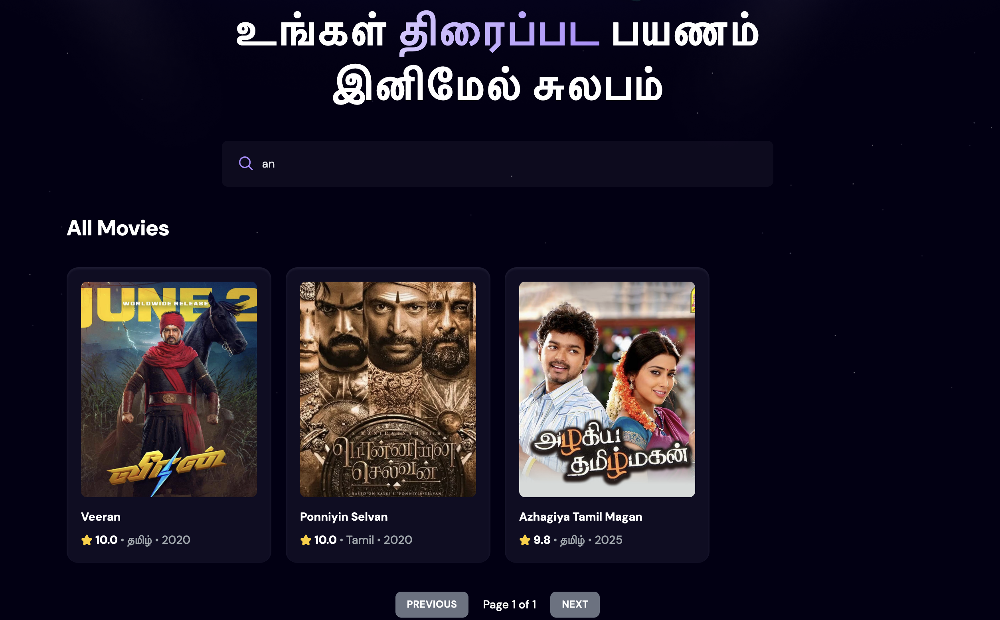
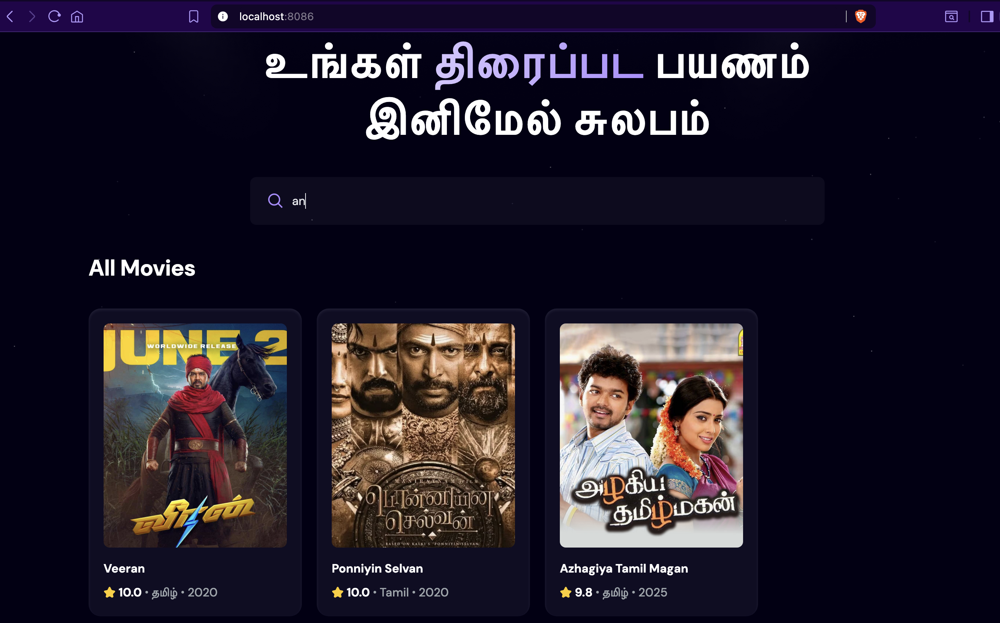
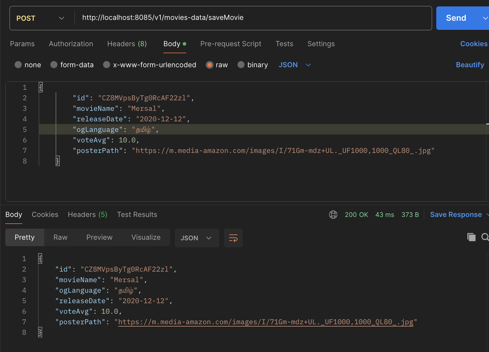

[](https://reactjs.org/)
[](https://spring.io/projects/spring-boot)
[](https://www.elastic.co/elasticsearch/)
[](LICENSE)
[](https://www.docker.com/)

# Movie Search Application

A **containerized full-stack movie search application** built using **React**, **Spring Boot**, and **Elasticsearch**.  
This project allows users to search for movies with real-time fuzzy search capabilities and manage movie data through RESTful APIs.

### Application UI




### Postman Request Example



---

## Table of Contents

- [Overview](#overview)
- [Architecture](#architecture)
- [Tech Stack](#tech-stack)
- [Features](#features)
- [Application Setup](#application-setup)
- [Frontend (React)](#frontend-react)
- [Backend (Spring Boot)](#backend-spring-boot)
- [API Endpoints](#api-endpoints)
- [License](#license)

---

## Overview

This application enables users to search for and retrieve movie data using Elasticsearch as the search engine for efficient indexing and fuzzy matching.  
Movie data can be added, updated, and deleted via dedicated backend endpoints, typically accessed using Postman or similar tools.

---

## Architecture

```
+-------------------------------+
| React Frontend (Port: 8086) |
+-------------------------------+
             |
             v
+-------------------------------+
| Spring Boot Backend (Port: 8085) |
+-------------------------------+
             |
             v
+-------------------------------+
| Elasticsearch (Search Engine) |
+-------------------------------+
```

The frontend communicates with the backend via RESTful APIs.  
The backend handles all data interactions with Elasticsearch.

---

## Tech Stack

- **Frontend:** React (JavaScript)
- **Backend:** Spring Boot (Java)
- **Search Engine:** Elasticsearch
- **Containerization:** Docker
- **Build Tools:** Maven, npm/yarn

---

## Features

- Movie search using fuzzy matching with Elasticsearch
- List all movies with a single API request
- Add, update, or delete movies through backend endpoints
- Containerized setup for easy deployment

---

## Application Setup

1. Clone this repository

```
   git clone https://github.com/harish124/movie-app-react.git
   cd movie-app-react/
```

2. Ensure Docker and Docker Compose are installed.

3. Build and run the containers:

```
   docker-compose up -d
```

4. Access the applications:

- Frontend (React): [http://localhost:8086](http://localhost:8086)
- Backend (Spring Boot): [http://localhost:8085](http://localhost:8085)

---

## Frontend (React)

- Runs on port **8086**.
- Serves a user interface for searching movies and displaying results fetched from the backend.

---

## Backend (Spring Boot)

- Runs on port **8085**.
- Exposes RESTful API endpoints for movies data.
- Uses Elasticsearch as the data storage and search engine.

---

## API Endpoints

### Public Endpoints

| Method | Endpoint                                               | Description                                                 |
| ------ | ------------------------------------------------------ | ----------------------------------------------------------- |
| GET    | `/v1/movies-data/getMovies`                            | Fetch all movies                                            |
| GET    | `/v1/movies-data/getMoviesContainingChars?characters=` | Fetch all movies containing given characters (fuzzy search) |

### Admin/Private Endpoints (for managing data)

| Method | Endpoint                      | Description                    |
| ------ | ----------------------------- | ------------------------------ |
| POST   | `/v1/movies-data/saveMovie`   | Save a new movie               |
| PUT    | `/v1/movies-data/update/{id}` | Update an existing movie by ID |
| DELETE | `/v1/movies-data/delete/{id}` | Delete a movie by ID           |

---

## License

This project is licensed under the **MIT License** — see the LICENSE file for details.
